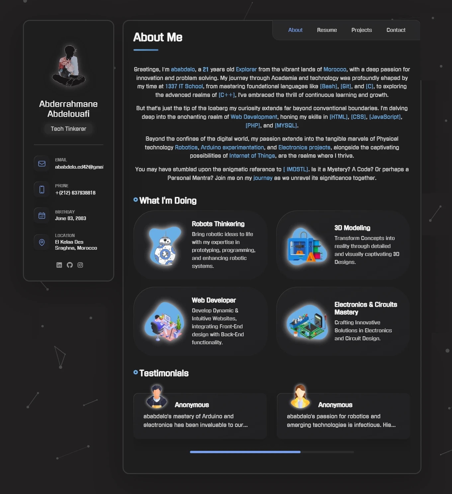
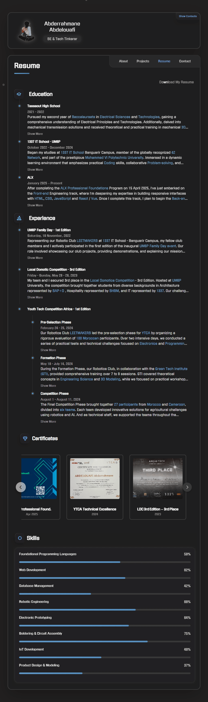

 Portfolio of Abderrahmane Abdelouafi

Welcome to my portfolio repository.

   &nbsp;&nbsp;
   &nbsp;&nbsp;
   &nbsp;&nbsp;
   &nbsp;&nbsp;
  

## Overview

This portfolio is designed to highlight my journey as a tech enthusiast, detailing my educational background, technical proficiencies, and the projects I've undertaken. It aims to provide a clear and organized presentation of my work and the technologies I've mastered.

## Features

- **📌 About Me:** An introduction to my background, interests, and the path that led me to technology.
- **📄 Resume:** A detailed account of my educational and professional experiences, including my time at 1337 IT School and involvement in various projects.
- **🛠️ Projects:** A showcase of projects that I worked on, demonstrating my skills.
- **📬 Contact:** Information on how to reach me for potential collaborations or inquiries, with a fully functional contact form.

Each section of my portfolio is **carefully designed** to deliver the best possible experience for visitors.  

## Technologies Used

The portfolio is built using modern web technologies to ensure **performance, flexibility, and scalability**:  

- **Frontend:**  
  - 
 Semantic and structured markup.  

  - 
 (PURE - NO FRAMEWORKS) – Modern styling techniques with animations and responsive layouts. 
 
  - 
 (VANILLA - NO LIBRARIES) – Enhancing interactivity and dynamic elements.  

- **Version Control & Hosting:**  
-   - 
 For repository management.  

  - 🛠️ GitHub Pages – Hosting the portfolio.  
  - 🌐 Custom Public DNS – Mapped to [edunwant42.tech](https://edunwant42.tech).  

- **Performance & Optimization:**  
  - 🚀 Lazy loading images for faster rendering.  
  - ⚡ Minified assets for improved speed.
  - 🔧 More optimizations...

## Preview and Live Version

- the url to my live hosted portfolio : [edunwant42.tech](https://edunwant42.tech).
- Below are preview images of the key sections of my portfolio:  

  
| About Me | Resume | Project Showcase 1 | Project Showcase 2 | Contact |
|:--------:|:------:|:------------------:|:------------------:|:-------:|
|  |  |  |  |  |

## 🤝 Contributing

I welcome contributions and suggestions to enhance this portfolio. If you have ideas or improvements, please feel free to submit a pull request or open an issue.

## 📜 License

This project is licensed under the MIT License. See the [LICENSE](LICENSE) file for more details.

##  ☎️ Contact

For any inquiries or collaboration opportunities, please reach out to me at:

     &nbsp;&nbsp;
     &nbsp;&nbsp;
     &nbsp;&nbsp;
     &nbsp;&nbsp;

