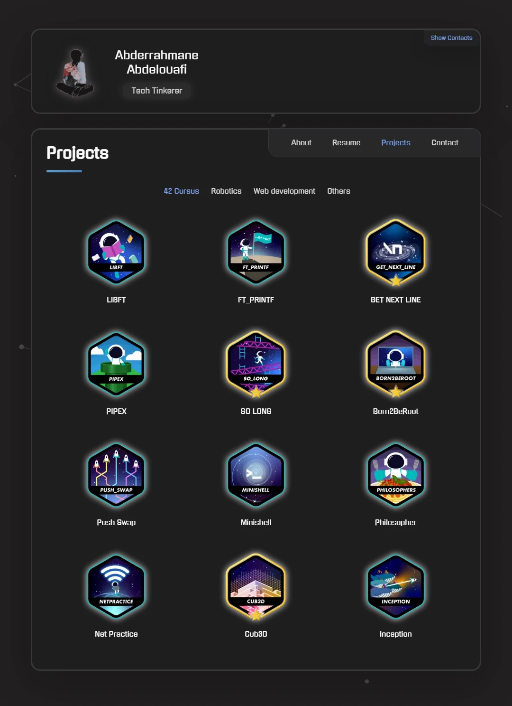
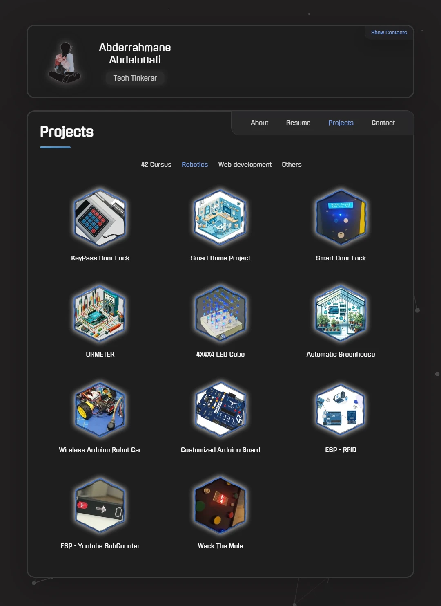

<!-- Title -->
<h1 align="center" style="color: #6BAEE5;">Portfolio</h1>

<!-- Introduction -->

  Hey there! Welcome to my personal portfolio repository. Curious about my latest work? Visit <a href="https://edunwant42.tech" target="_blank" style="color: #6BAEE5;">my portfolio</a> to dive into my projects, skills, and more.

## Portfolio Preview

Take a quick look at the key sections of my portfolio:

| About Section | Resume Section | Projects Section Example 1 | Projects Section Example 2 | Contact Section |
|:-------------:|:--------------:|:-----------------:|:-----------------:|:-----------------:|
|  |  |  |  |  |

## ✨ Features

Explore what makes my portfolio unique:

- **Responsive Design:** Seamlessly adapts to any screen size for an optimal viewing experience.
- **Projects Showcase:** A curated collection of my projects with detailed descriptions and live demos.
- **Skills Spotlight:** A comprehensive breakdown of my technical abilities.
- **Contact Form:** Easily get in touch if you're looking to collaborate or have any questions.

## 🛠 Technologies Used

This portfolio is built with:

- **HTML5:** For robust and semantic structure.
- **CSS3:** To enhance visual appeal with modern styles.
- **JavaScript:** Adding interactivity and dynamic features.

## 🤝 Contributions and Feedback

Your input is invaluable! If you have suggestions or would like to collaborate, please open an issue or submit a pull request.

## 📄 License

This project is licensed under the [MIT License](LICENSE).

 

Thanks for stopping by and taking a peek at my work!

